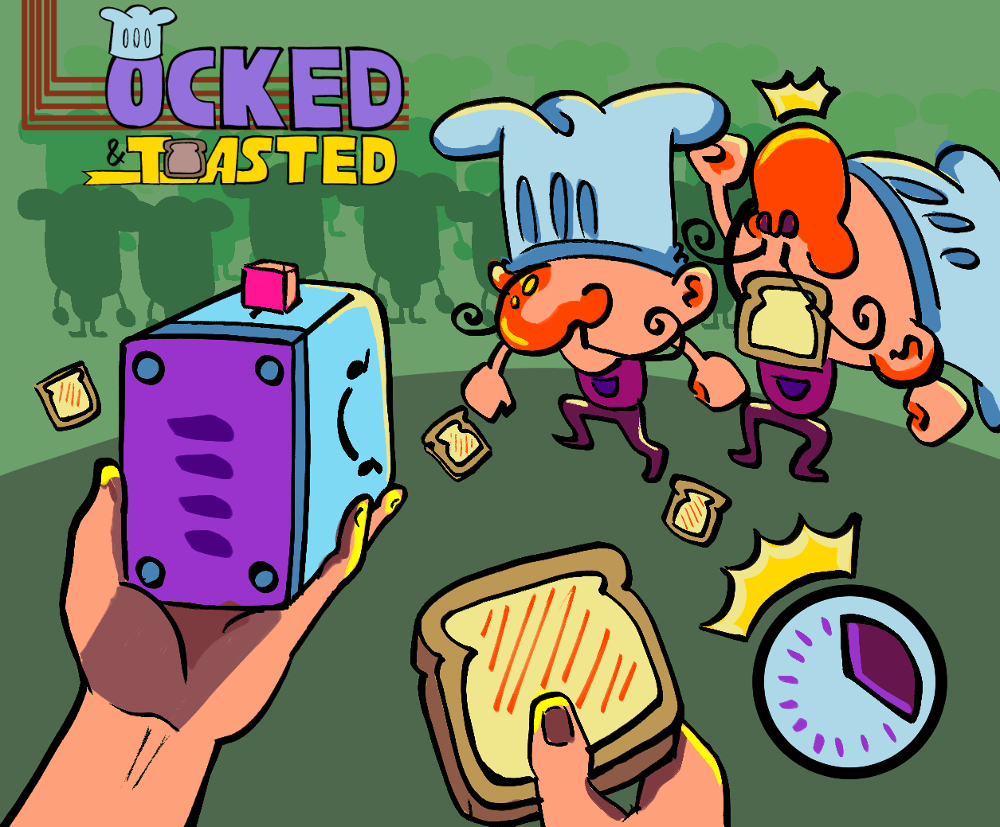
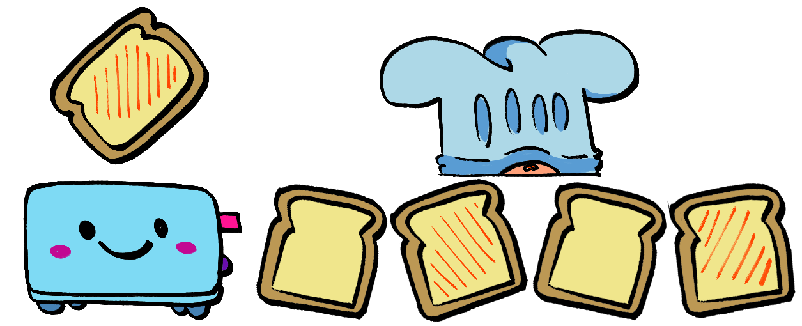

# Locked-and-Toasted! (GTMK 2026)

The evil bakery across the street has taken the secret recipe to your bakery's success: The Carb-ine 3000. Infiltrate among the french chefs found within the enemy lines and get out with the power of toast and friendship. Play the game [here](https://eddysanoli.itch.io/locked-and-toasted)

2026 submission to the [GMTK Game Jam](https://itch.io/jam/gmtk-jam-2026).

## Theme

**Count-down**

*How does this game fit the theme?* The toaster gun used for the game is powered by a countdown. The closer you shoot to the timer's end, the more damage you'll do

## Instructions

Install Godot 4.7.1-stable using [GDVM](https://github.com/adalinesimonian/gdvm). After installing GDVM, run the project by running `gdvm run '4.7.1-stable' and then opening the project in Godot.

Deployment to Itch.io is handled automatically by GitHub Actions. Used the following [project](https://github.com/antzGames/Godot_to_itch_GitHub_Action) as a template.

----

*Made with frijolitos and Godot 4.7.1*
